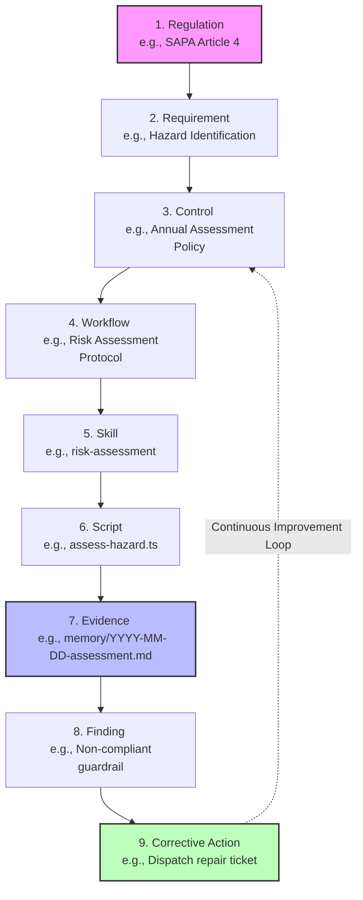

# Safety OS Playbook v4.0

# Part I — Executive Summary

## Document Control

| Property | Value |
|----------|-------|
| Document ID | 01-executive-summary.md |
| Status | Draft |
| Date | 2026-06-05 |
| Classification | Internal |

## 1.1 Vision

Safety OS is designed to be the comprehensive, multi-agent operating system for Environmental Health & Safety (EHS) compliance, specifically tailored to meet the stringent requirements of South Korean regulations such as the Occupational Safety and Health Act (OSHA-KR) and the Serious Accidents Punishment Act (SAPA). Our vision is to eliminate the silos between safety strategy, daily workflow execution, and compliance auditing by introducing an intelligent, AI-driven governance architecture. By integrating specialized agents that handle everything from risk assessment to emergency response, Safety OS ensures that safety is not just a reactive measure, but a proactive, continuous operational standard. The system is built to provide an unbroken chain of custody for all safety data, ensuring that every action taken on the manufacturing floor is tied directly to a legal basis and an audit trail.

This visionary approach shifts the paradigm from manual, paper-based compliance tracking to a real-time, orchestrated safety ecosystem. Agents communicate, delegate, and verify tasks autonomously under the strict oversight of the PM (Chief Safety Officer), guaranteeing that no safety protocol is overlooked. Safety OS is more than a tool; it is a foundational platform that empowers organizations to achieve zero-incident workplaces while confidently navigating complex regulatory landscapes.

## 1.2 Business Drivers

The development and deployment of Safety OS are driven by several critical business imperatives:

1. **Regulatory Compliance and Risk Mitigation**: With the introduction of SAPA, executive liability for workplace accidents has significantly increased. Organizations need a foolproof system to demonstrate continuous compliance and proactive risk management to avoid severe legal and financial penalties.
2. **Operational Efficiency**: Manual safety inspections, permit approvals, and incident reporting are time-consuming and error-prone. Automating these workflows through specialized agents reduces administrative overhead and allows human personnel to focus on higher-value tasks.
3. **Data-Driven Decision Making**: Siloed safety data prevents organizations from identifying systemic risks. Safety OS centralizes EHS data, providing executives and safety managers with real-time dashboards and predictive analytics to intervene before accidents occur.
4. **Standardization Across Facilities**: For enterprises with multiple manufacturing sites, maintaining consistent safety standards is a major challenge. A centralized OS ensures that safety protocols are uniformly enforced across all locations.
5. **Audit Readiness**: Preparing for regulatory audits often requires weeks of document gathering. Safety OS's "Traceability by Design" guarantees that the organization is always audit-ready, with evidence models automatically generated and securely stored.

## 1.3 Design Principles

The architecture and operational model of Safety OS are governed by seven core design principles:

1. **Discover Before Create**: Agents must query existing knowledge bases, historical incident reports, and risk registers before initiating new risk assessments or workflows. This prevents duplication of effort and ensures that decisions are based on the most current data.
2. **Workflow First**: All safety operations are defined as structured workflows rather than ad-hoc tasks. Workflows dictate the sequence of agent interactions, required approvals, and evidence generation.
3. **Traceability by Design**: Every action, decision, and communication within the system must be logged with a timestamp, the responsible agent's ID, the associated workflow ID, and the explicit legal basis (e.g., specific articles from OSHA-KR or SAPA).
4. **PM Gateway Enforcement**: The PM agent (acting as CSO) serves as the single point of entry and orchestration. Specialist agents cannot be invoked directly by users or bypass the PM's authorization. This ensures centralized governance and compliance gating.
5. **Fail-Safe Autonomy**: While agents operate autonomously within their domains, any uncertainty, missing legal basis, or high-risk scenario must trigger an immediate escalation to human operators or the PM agent.
6. **Immutable Audit Trails**: Evidence records generated by the system (e.g., completed Permit-to-Work forms, incident logs) are treated as immutable artifacts. Any modifications require a new version to be created, preserving the historical record for regulatory scrutiny.
7. **Modular Extensibility**: The agent roster and skill set are designed to be modular. As new regulations are enacted or new operational requirements arise, new specialist agents and workflows can be integrated without disrupting the core OS architecture.

# Safety OS Blueprint: Part II — Enterprise Architecture

## Document Control

| Version | Date       | Author          | Description                                  |
| :---    | :---       | :---            | :---                                         |
| 1.0.0   | 2026-06-05 | Architect Agent | Initial draft for Enterprise Architecture    |

## 2.0 Executive Summary

The Enterprise Architecture for Safety OS defines a robust, scalable, and highly compliant system designed specifically to manage Environmental Health & Safety (EHS) operations. Operating within the stringent regulatory frameworks of South Korea, this architecture directly addresses the operational mandates of the Occupational Safety and Health Act (OSHA-KR) and the severe liability parameters of the Serious Accidents Punishment Act (SAPA). 

This document outlines the structural design, technology choices, and traceability paradigms that form the bedrock of the Safety OS platform. The architecture is inherently modular, leveraging advanced multi-agent orchestration, knowledge graph integrations, and impenetrable audibility layers. These components ensure both the flexibility required in dynamic manufacturing or operational workflows and the rigidity necessary for legal compliance verification. By defining clear boundaries across nine distinct layers, the system prevents unauthorized actions, maintains an unbroken chain of evidence, and enables rapid adaptation to evolving safety regulations.

---

## 2.1 Reference Architecture

The Safety OS Reference Architecture is structurally partitioned into nine distinct layers (Layer 0 through Layer 8), with each layer serving a clearly defined functional domain. This layered, decoupled approach ensures separation of concerns, simplifies maintenance, and allows for independent scaling of different system components. The architecture emphasizes a decentralized, agent-driven execution model where specialized AI agents collaborate across these layers to fulfill complex EHS workflows without compromising security or operational integrity.

### Architecture Overview Diagram

```mermaid
flowchart TD
    subgraph Layer 8: Security, Governance & Compliance
        L8_1[Identity & Access Mgmt]
        L8_2[Immutable Audit Logging]
        L8_3[SAPA/OSHA-KR Policy Enforcement]
        L8_4[Zero-Trust Agent Boundaries]
    end

    subgraph Layer 7: User Interface & Experience
        L7_1[Antigravity CLI / User Terminal]
        L7_2[Markdown Artifact Renderers]
        L7_3[Interactive Dashboards]
    end

    subgraph Layer 6: EHS Domain Applications
        L6_1[Risk Assessment & Matrix Module]
        L6_2[Permit-to-Work (PTW) Gateway]
        L6_3[Incident Response & Escalation]
        L6_4[Compliance Gap Analyzer]
    end

    subgraph Layer 5: Enterprise Services & APIs
        L5_1[MCP Tool Registry]
        L5_2[Workflow Execution Engine]
        L5_3[External Integration Gateway]
    end

    subgraph Layer 4: AI Models & LLM Engine
        L4_1[Claude 3.5 / Gemini 1.5 Subsystems]
        L4_2[3-Tier Model Routing Strategy]
        L4_3[Context Window Manager]
    end

    subgraph Layer 3: Agent Orchestration
        L3_1[PM / Chief Safety Officer Gateway]
        L3_2[Specialist Agent Pool]
        L3_3[Subagent Dispatcher & Concurrency]
    end

    subgraph Layer 2: Core Platform & Integration
        L2_1[File System IO & UTF-8 Enforcement]
        L2_2[GitHub Sync & Pre-commit Hooks]
        L2_3[Local Shell Executor]
    end

    subgraph Layer 1: Data Storage & Knowledge Graph
        L1_1[Local File Storage / Workspace]
        L1_2[CodeGraph Database]
        L1_3[Memory & Session Logging]
    end

    subgraph Layer 0: Infrastructure & Hosting
        L0_1[Local On-Premises Hardware]
        L0_2[Windows OS Environment]
        L0_3[Air-Gapped Subnets]
    end

    L7_1 --> L8_1
    L7_1 --> L3_1
    L6_1 --> L5_2
    L3_1 --> L3_2
    L3_1 --> L4_2
    L3_2 --> L5_1
    L5_1 --> L2_1
    L5_1 --> L2_2
    L2_1 --> L1_1
    L2_1 --> L1_2
    L1_1 --> L0_1
    
    L8_2 -.-> L1_1
    L8_3 -.-> L3_1
```

### Layer Deep Dive

#### Layer 0: Infrastructure & Hosting
At the absolute foundation, Layer 0 provides the physical or virtualized computing resources required to run Safety OS. In its primary configuration, the system operates on the user's local hardware (specifically optimized for Windows environments typical in enterprise corporate networks). This on-premises focus is highly intentional; it maintains strict data sovereignty and eliminates cloud dependency for sensitive enterprise data, trade secrets, and internal safety vulnerabilities. The infrastructure layer is designed to support air-gapped environments often found in secure manufacturing facilities.

#### Layer 1: Data Storage & Knowledge Graph
This layer handles the persistence of all system artifacts, configurations, state, and historical memory. Instead of relying solely on traditional relational databases, Safety OS embraces a "docs-as-code" paradigm utilizing local file storage for markdown-based configuration, coupled with graph databases for relational mapping.
- **Local Markdown Workspace:** All agent definitions, system prompts, operational workflows, and historical session logs (`memory/` directory) are stored as flat files. This ensures human readability and version control simplicity.
- **CodeGraph Integration:** CodeGraph maintains a continuous semantic understanding of the codebase and document relationships. It allows agents to navigate complex project structures efficiently, understanding how a change in a regulation file impacts a specific risk assessment template.

#### Layer 2: Core Platform & Integration
Layer 2 provides the fundamental building blocks for interacting with the underlying OS and external code repositories. It bridges the AI logic with physical machine state.
- **File System IO:** Strictly enforced UTF-8 read/write utilities that agents use to modify artifacts. This prevents encoding corruptions common in localized Korean environments (CP949).
- **GitHub Sync:** Native Git synchronization mechanisms ensure strict version control. All changes to configurations or safety protocols must pass through automated CI/CD pipelines and QA audit scripts before being merged into the main branch.

#### Layer 3: Agent Orchestration & Coordination
The intelligence hub of the multi-agent system. Layer 3 manages the lifecycle, dispatching, and inter-agent communication, ensuring that no agent exceeds its authority.
- **PM / Chief Safety Officer (CSO) Gateway:** The singular, highly privileged entry point for user requests. The PM triages inputs, verifies the `legal_basis` for any requested action, and acts as the gatekeeper. Users cannot invoke specialized agents directly.
- **Specialist Agent Pool:** Domain-specific entities like the Safety Governance Manager, Compliance Agent, Risk Assessment Agent, and Emergency Agent. Each possesses strict boundaries and localized contexts.
- **Subagent Dispatcher:** Handles the spawning of parallel execution agents (e.g., Automation Engineers) for distributed task processing, utilizing reactive wakeup mechanisms to avoid costly polling loops.

#### Layer 4: AI Models & LLM Engine
Layer 4 abstracts the underlying Large Language Models, optimizing for cost, speed, and reasoning capability through a strict 3-Tier Model Routing Strategy:
- **High-Tier (Reasoning):** Deployed for the PM and Architect agents. Utilizes the most capable models for complex reasoning, architectural planning, and interpreting ambiguous legal statutes.
- **Medium-Tier (Review):** Deployed for Quality Assurance, code review, and audit validation. Provides a balance of speed and reliability to ensure executing agents followed instructions.
- **Low-Tier (Execution):** Deployed for rapid code generation, text replacement, and simple execution tasks where the parameters are strictly defined.

#### Layer 5: Enterprise Services & APIs
This layer exposes reusable tools and skills to the agents via the Model Context Protocol (MCP).
- **MCP Tool Registry:** A standardized registry of capabilities (e.g., `write_to_file`, `search_web`, `run_command`). MCP enables seamless, secure integration of file system tools without giving the LLM raw shell access by default.
- **Workflow Execution Engine:** Parses structured EHS operational sequences (e.g., standard operating procedures) and translates them into actionable tool calls for the agents.

#### Layer 6: EHS Domain Applications
Layer 6 contains the localized business logic specific to South Korean EHS compliance and facility operations.
- **Risk Assessment Module:** Automates hazard identification and scoring based on user input or sensor data, generating compliant risk registers.
- **Permit-to-Work (PTW):** Orchestrates the issuance, validation, and archiving of high-risk work permits.
- **Incident Response Tracker:** Escalates emergencies to human operators and logs immediate remediation steps to demonstrate legal due diligence.

#### Layer 7: User Interface & Experience
The interaction point for human operators and facility managers. 
- **Antigravity CLI / User Terminal:** The primary execution environment providing a chat-like command structure.
- **Markdown Artifacts:** Dashboards, implementation plans, and reports generated by the system are rendered as interactive Markdown artifacts, supporting alerts, Mermaid diagrams, and code diffs for immediate user review.

#### Layer 8: Security, Governance & Compliance
An overarching, cross-cutting layer that intersects all others. It acts as the ultimate authority for system actions.
- **Legal Basis Gate:** Enforces the requirement that every workflow execution must reference a specific legal article. If a workflow lacks a `legal_basis` field, execution is halted.
- **Immutable Audit Logging:** Ensures that every decision made by an agent, every file edited, and every evidence artifact generated is timestamped and cryptographically signed within the Git history, providing an unassailable audit trail for regulatory inspectors.

---

## 2.2 Technology Stack

The technology stack underpinning Safety OS is carefully selected to support a highly autonomous, transparent, and verifiable AI-driven platform. The stack is categorized into Primary (currently active core components), Extended (domain-specific integrations for the Korean market), and Future (planned expansions for enterprise scalability).

### Primary Stack
These are the core technologies driving the day-to-day operations, orchestration, and state management of Safety OS:
- **CodeGraph:** Moving beyond simple lexical `grep` searches, CodeGraph provides advanced semantic code intelligence. It maps relationships between files, agents, workflows, and legal requirements, allowing agents to navigate the workspace contextually and understand the blast radius of any operational change.
- **Antigravity CLI / Claude Code:** The primary execution environments and orchestrators. They provide the shell context for running the agentic loops, handling user input, and rendering UI artifacts directly in the developer or manager's terminal.
- **GitHub / Git:** The single source of truth for version control and state mutation. All configuration changes, workflow updates, and agent memory logs are synchronized via Git. Strict pre-commit hooks ensure that direct code modification bypassing the PM's QA gates are blocked.
- **Model Context Protocol (MCP):** The standardized, secure communication protocol used to expose tools (skills) to the LLMs. MCP acts as a secure bridge, allowing the AI to safely interact with local file systems, database queries, and external APIs without exposing underlying system vulnerabilities.
- **Markdown (MD) & Mermaid JS:** The absolute standard formats for all documentation, planning, and architectural diagrams. They ensure that knowledge remains fully human-readable for audits while being easily parseable by LLMs.

### Extended Stack (Domain Specific)
Technologies tailored specifically for the South Korean EHS context and specialized industry workflows:
- **mcp-kr-legislation:** A custom, proprietary MCP server providing agents with direct querying capabilities against the South Korean legislative database. It allows agents to pull exact, up-to-date article texts from OSHA-KR and SAPA, guaranteeing that the mandatory `legal_basis` requirement is grounded in current law.
- **K-Skill Architecture:** A specialized suite of MCP tools and predefined markdown workflows adapted for local business practices. This includes standardized risk assessment matrices formatted for the Ministry of Employment and Labor (MOEL) and automated translation layers handling the crossover between English documentation requirements and Korean operational interfaces.

### Future Stack
Technologies slated for future integration to enhance system intelligence and enterprise reach:
- **Neo4j Graph Database:** Intended to eventually supplement CodeGraph for more complex, enterprise-wide knowledge representation. Neo4j will allow for deep, multi-hop queries across the entire Knowledge Traceability Model, identifying systemic risks across disparate manufacturing plants and correlating incidents to specific policy failures.
- **OpenAI Agent SDK:** To provide optionality and prevent vendor lock-in, the architecture is designed to eventually support OpenAI's agent frameworks alongside the current Anthropic/Google-centric models, enabling a true hybrid multi-model orchestration strategy based on cost-efficiency.

---

## 2.3 Knowledge Traceability Model

A cornerstone of the Safety OS architecture is its unbreakable chain of evidence and justification. In the context of EHS compliance—particularly under the severe personal liability parameters outlined in the Serious Accidents Punishment Act (SAPA)—it is never enough for an automated system to simply execute a task. The system must definitively prove *why* the task was executed, *how* it addresses a specific legal requirement, and *who* authorized it.

The Knowledge Traceability Model establishes a strict, directional hierarchy connecting high-level government regulations to granular, machine-executable artifacts. Every action taken by a Safety OS agent must be traceable back up this chain. If a link in the chain is broken or missing, the action is flagged as non-compliant and halted by the PM Gateway.

### Traceability Hierarchy

1. **Regulation:** The foundational law establishing legal liability (e.g., SAPA Article 4, OSHA-KR Article 36).
2. **Requirement:** A specific, actionable mandate derived from the regulation (e.g., "The business owner must establish a comprehensive risk assessment procedure").
3. **Control:** The internal organizational policy or management system designed to meet the requirement (e.g., "Annual Plant-Wide Risk Assessment Policy v2.1").
4. **Workflow:** The step-by-step procedural document defined in Safety OS to implement the control (e.g., `workflows/annual-risk-assessment.md`).
5. **Skill:** The specific agent capability or MCP tool required to execute a step in the workflow (e.g., `risk-assessment-agent` utilizing the `risk-matrix-calculator` skill).
6. **Script:** The underlying deterministic code executing the skill securely (e.g., `scripts/assess-hazard.ts`).
7. **Evidence:** The immutable artifact generated upon execution, permanently logged in the system (e.g., `memory/2026-06-05-assessment-zone-A.md`).
8. **Finding:** An observation derived from the evidence (e.g., "High-risk identified: Non-compliant guardrail near Stamping Press 4").
9. **Corrective Action:** The steps taken to resolve the finding, which feeds back into the system to improve the foundational Control, demonstrating continuous improvement.

### Traceability Chain Diagram



### Operationalizing Traceability for Legal Defense

The traceability model is not merely a theoretical diagram; it is mechanically enforced via the `legal_basis` gateway. 

When the PM / CSO agent receives a request from a floor manager to initiate a workflow (for instance, executing a Permit-to-Work for confined space entry), the PM first parses the defined markdown workflow. The workflow definition file MUST contain frontmatter metadata explicitly linking it to a Requirement and a Regulation. 

```yaml
# Example Workflow Header
name: Confined Space Permit-to-Work
legal_basis: OSHA-KR Article 114
control_ref: CTRL-089-Confined-Space
```

If the `legal_basis` tag is missing, the PM agent actively rejects the request, generating an Escalation alert indicating that the workflow cannot be legally justified.

When the executing specialist agent (e.g., the Safety Workflow Manager) successfully completes the task, it generates an Evidence record in the `memory/` directory. This Evidence record automatically inherits the metadata of its parent Workflow, appending execution timestamps, agent IDs, and cryptographic hashes of the file state.

During a regulatory audit (whether simulated internally or conducted by the Ministry of Employment and Labor), the Audit Agent leverages this model to generate comprehensive compliance reports instantaneously. 

- **Top-Down Querying:** An auditor can start at SAPA Article 4 and query downwards: *"Show me all Controls, Workflows, and generated Evidence tied to this article in the past quarter."* The CodeGraph retrieves exactly the chain of documents linking the law to the factory floor operations.
- **Bottom-Up Querying:** Conversely, an auditor can start at a specific Corrective Action or incident report and trace upwards to verify that the action directly addressed a legal Requirement and followed approved policy. 

This bidirectional traceability is the ultimate safeguard. It transforms subjective safety management into objective, provable data, establishing an ironclad defense of "due diligence" under South Korean legal frameworks.

# Part III — Governance Architecture

## Document Control

| Property | Value |
|----------|-------|
| Document ID | 03-governance.md |
| Status | Draft |
| Date | 2026-06-05 |
| Classification | Internal |

## 3.1 Hierarchy

The governance architecture of Safety OS is strictly hierarchical, ensuring that strategy dictates execution, and execution is continually monitored for compliance.

*   **Top Tier (Strategic)**: The PM Agent (acting as Chief Safety Officer).
*   **Middle Tier (Management)**: Safety Governance Manager (SGM) and Safety Workflow Manager (SWM).
*   **Execution Tier (Operational)**: Specialist Agents (Compliance, Risk, Emergency, Audit, etc.).

All requests flow from the user through the PM. The PM delegates strategic planning and objective setting to the SGM, while operational execution and daily task routing are handled by the SWM. Specialist agents operate under the direct supervision of the SWM or PM, executing specific tasks within defined boundaries.

## 3.2 PM as CSO (Chief Safety Officer)

In the Safety OS ecosystem, the PM agent assumes the critical role of Chief Safety Officer (CSO). The CSO is the ultimate gatekeeper for all system actions.

*   **Gateway Enforcement**: The CSO enforces the "PM Gateway" policy. No specialist agent can be invoked directly by a user.
*   **Legal Basis Verification**: Before any workflow is dispatched, the CSO must verify the presence of a valid `legal_basis` (e.g., OSHA-KR Article 36).
*   **Escalation Point**: The CSO handles all out-of-bounds requests, permission denials, and critical escalations from subordinate agents.
*   **Final Approver**: For high-risk operations or significant architecture changes, the CSO provides the final sign-off before execution.

## 3.3 Safety Governance Manager (SGM)

The Safety Governance Manager is responsible for the strategic alignment of the organization's EHS objectives with regulatory requirements.

*   **KPI Definition**: The SGM defines and tracks safety Key Performance Indicators (KPIs) such as Incident Frequency Rates and Audit Pass Rates.
*   **Compliance Strategy**: It translates abstract regulatory requirements (like SAPA's mandate for an occupational safety and health management system) into concrete objectives.
*   **Annual Planning**: The SGM assists in generating annual safety plans and distributing safety targets across different organizational units.

## 3.4 Safety Workflow Manager (SWM)

The Safety Workflow Manager translates the strategy set by the SGM into daily operational reality on the manufacturing floor.

*   **Workflow Orchestration**: The SWM coordinates complex, multi-agent workflows such as the Permit-to-Work (PTW) process.
*   **Resource Allocation**: It assigns tasks to appropriate specialist agents (e.g., routing a hazard report to the Risk Assessment Agent).
*   **Real-time Monitoring**: The SWM monitors the status of all active workflows, identifying bottlenecks and ensuring timely completion of safety-critical tasks.

## 3.5 Agent Team Assembly

Agent teams in Safety OS are assembled dynamically based on the requirements of the requested workflow, but always under the PM's orchestration.

*   **Task Decomposition**: The PM or SWM breaks down a high-level request into specific tasks requiring distinct skills.
*   **Specialist Selection**: Agents are selected from the roster based on their predefined capabilities (e.g., Compliance Agent for regulatory checks, Audit Agent for evidence verification).
*   **Parallel Execution**: When tasks have no sequential dependencies, multiple agents may be dispatched simultaneously to improve efficiency, communicating results back to the orchestrating manager.

## 3.6 Document Governance

Document governance is a critical component of regulatory compliance. Safety OS enforces strict rules on document creation, modification, and storage.

*   **Language Policy**: All workspace documentation files must be written in English, with explicit exceptions for recognized locale translation zones (e.g., `ko/`).
*   **Evidence Traceability**: All generated records (evidence models) must include a timestamp, agent ID, workflow ID, and the legal basis.
*   **Centralized Storage**: Documents are organized into designated directories (`docs/` for analysis, `memory/` for session logs and evidence), preventing fragmentation.
*   **Version Control**: Immutable audit trails are maintained by ensuring that approved documents are version-controlled and changes are tracked through automated QA gates.

## 3.7 Public Data Attribution

Whenever legal data from `Legalize KR` or `mcp-kr-legislation` is used, the system must automatically append the following text to outputs or UIs: "본 데이터는 대한민국 법제처/국가법령정보센터의 데이터를 기반으로 함".

# Part IV — Agent Architecture

## Document Control

| Property | Value |
|----------|-------|
| Document ID | 04-agent-catalog.md |
| Status | Draft |
| Date | 2026-06-05 |
| Classification | Internal |

## 15 Agent Catalog

The Safety OS agent ecosystem is composed of specialized agents, each designed to handle specific domains of the Environmental Health & Safety lifecycle. The rollout is structured across multiple priorities to ensure foundational capabilities are stabilized before introducing advanced functionalities.

### Priority 1 (MVP Scope)

These agents form the core of Safety OS and are essential for basic regulatory compliance and operational governance.

1.  **PM / Chief Safety Officer (CSO)**: The overarching orchestrator and gateway. Enforces the legal basis gate, manages permissions, and coordinates the entire agent ecosystem.
2.  **Safety Governance Manager (SGM)**: Responsible for EHS strategy, setting compliance objectives, defining KPIs, and tracking long-term SAPA/OSHA-KR goals.
3.  **Safety Workflow Manager (SWM)**: Handles operational dispatch, coordinates daily workflows on the manufacturing floor, and manages execution-level agent teams.
4.  **Compliance Agent**: Monitors regulatory changes, tracks specific OSHA-KR and SAPA requirements, and flags potential non-compliance in real-time.
5.  **Risk Assessment Agent**: Executes daily and periodic risk assessments, identifies hazards, scores risks, and maintains the centralized risk register.
6.  **Emergency Agent**: Coordinates emergency response protocols, manages incident escalations, and ensures immediate action during fires, spills, or injuries.
7.  **Audit Agent**: Validates evidence records, prepares audit trails, and ensures the organization is ready for regulatory inspections.

### Priority 2 (Phase 1)

These agents build upon the MVP to provide deeper operational control and incident management.

8.  **Process Safety Management (PSM) Agent**: Specializes in highly hazardous processes, managing Management of Change (MOC) workflows and Pre-Startup Safety Reviews (PSSR).
9.  **Incident Investigation Agent**: Conducts root cause analysis following an incident, interviewing data sources and generating comprehensive investigation reports.
10. **Contractor Safety Agent**: Manages the safety compliance of external vendors and contractors, ensuring their certifications and safety plans meet organizational standards.
11. **Asset & Maintenance Agent**: Tracks the safety status of physical machinery, schedules preventative maintenance, and links asset health to risk assessments.

### Priority 3 (Phase 2)

These agents introduce advanced capabilities for proactive learning, comprehensive reporting, and legal foresight.

12. **Training & Certification Agent**: Monitors employee safety training requirements, schedules sessions, and ensures no worker performs a task without valid certification.
13. **Reporting & Analytics Agent**: Aggregates data from all other agents to generate executive dashboards, predictive safety trends, and automated regulatory filings.
14. **Knowledge Graph Agent**: Constructs and queries a semantic knowledge graph of all safety entities (hazards, locations, personnel, regulations) to identify hidden systemic risks.
15. **Legal Intelligence Agent**: Monitors proposed legislative changes, analyzes case law related to SAPA, and advises the SGM on future compliance strategies.

# Part XII — Implementation Strategy

## Document Control

| Property | Value |
|----------|-------|
| Document ID | 05-implementation-roadmap.md |
| Status | Draft |
| Date | 2026-06-05 |
| Classification | Internal |

## Phase 0: Foundation and Scaffolding

*   **Objective**: Establish the core architecture, repository structure, and initial agent definitions.
*   **Key Deliverables**:
    *   Project scaffolding and directory structure.
    *   Base platform configuration (`CONSTITUTION.md`, `AGENTS.md`).
    *   Initial PM (CSO) agent deployment and gateway enforcement testing.
*   **Scope**: Internal engineering team focus.

## Phase A: Minimum Viable Product (MVP) Scope

*   **Objective**: Deploy the Priority 1 agents to handle basic compliance and critical workflows.
*   **Key Deliverables**:
    *   Deployment of SGM, SWM, Compliance, Risk, Emergency, and Audit agents.
    *   Implementation of the foundational Permit-to-Work (PTW) workflow.
    *   Basic risk assessment and hazard reporting pipelines.
    *   Establishment of the immutable evidence trail system.
*   **Scope**: Core manufacturing operations and baseline OSHA-KR/SAPA compliance.

## Phase 1: Operational Deepening

*   **Objective**: Introduce Priority 2 agents to cover complex operational scenarios.
*   **Key Deliverables**:
    *   Integration of PSM, Incident Investigation, Contractor, and Asset agents.
    *   Automated Root Cause Analysis (RCA) reporting.
    *   Contractor compliance tracking and gate access control integration.
    *   Management of Change (MOC) workflows.

## Phase 2 Extensions: Advanced Capabilities

Phase 2 focuses on scaling the system from a reactive compliance tool to a proactive, intelligent ecosystem.

*   **Knowledge Engineering**: Deployment of the Knowledge Graph Agent to map complex relationships between incidents, near-misses, machine telemetry, and regulatory clauses.
*   **Industry Expansion**: Adapting the core models to support specific industry verticals beyond general manufacturing (e.g., chemical processing, construction).
*   **Agent/Skill Expansion**: Introduction of the Legal Intelligence Agent and Training Agent, along with the development of custom skills for integrating with third-party ERP and HR systems.

## Phase 3-8: Continuous Iteration and Integration

*   **Objective**: Iterative enhancement based on user feedback and changing regulations.
*   **Key Deliverables**:
    *   Advanced predictive analytics dashboards.
    *   Integration with IoT sensors for real-time hazard detection.
    *   Cross-facility benchmarking and standardization.

## Phase 9: Full Autonomous Governance

*   **Objective**: Achieve mature, highly automated EHS governance requiring minimal human intervention for routine compliance.
*   **Key Deliverables**:
    *   Self-auditing systems.
    *   Automated regulatory filing and reporting.
    *   AI-driven continuous improvement of safety protocols.

# 7. Manufacturing Sector

## 7.1 Overview
This blueprint details the safety management approach for general manufacturing facilities.

## 7.2 Core Risks
- Moving machinery and entanglement hazards.
- Slips, trips, and falls.
- Ergonomic injuries.

## 7.3 Workflow Adaptations
Workflows in this sector are adapted for high-throughput environments where rapid response is required without impeding production. 

*Note: This blueprint covers general manufacturing and explicitly excludes Process Safety Management (PSM) protocols, which are detailed in the Chemical sector blueprint.*

## 7.4 Compliance Checklist
- General OSHA-KR guidelines for factory floors.
- Regular machinery guarding inspections.
- Mandatory Personal Protective Equipment (PPE) enforcement.

# 8. Chemical Sector

## 8.1 Overview
The chemical sector involves handling, processing, and storing hazardous materials. Safety management here is critically dependent on rigorous process safety.

## 8.2 Regulatory Framework — PSM 12 Elements

| Element | Description |
|---|---|
| 1. Process Safety Information | Comprehensive data on chemicals, technology, and equipment. |
| 2. Process Hazard Analysis | Identification and evaluation of hazards involved in the process. |
| 3. Operating Procedures | Clear instructions for safely conducting activities. |
| 4. Employee Training | Education on hazards and operating procedures. |
| 5. Contractors | Ensuring contractor safety aligns with facility standards. |
| 6. Pre-Startup Safety Review | Verification of equipment and procedures before use. |
| 7. Mechanical Integrity | Maintenance and inspection of critical equipment. |
| 8. Hot Work Permits | Control of activities that could ignite hazards. |
| 9. Management of Change | Reviewing changes to processes, equipment, or facilities. |
| 10. Incident Investigation | Analyzing incidents to prevent recurrence. |
| 11. Emergency Planning | Preparedness for potential catastrophic releases. |
| 12. Compliance Audits | Regular verification of PSM program effectiveness. |

## 8.3 Implementation Guidelines
Continuous monitoring and strict adherence to the 12 PSM elements are mandatory for SAPA compliance in chemical plants.

# 9. Semiconductor Sector

## 9.1 Overview
Semiconductor manufacturing involves cleanroom environments, toxic gases, and complex automated machinery.

## 9.2 Critical Hazards
- Chemical exposure (e.g., HF acid, specialized dopants).
- Electrical hazards from high-voltage equipment.
- Ergonomic issues in cleanroom environments.

## 9.3 Safety Protocols
- Strict gas monitoring systems.
- Automated material handling system (AMHS) safety zones.
- Cleanroom-specific emergency evacuation plans.

## 9.4 Compliance Strategy
Focus on precise environmental controls and rigorous exposure monitoring. Continuous integration with plant-wide IoT sensors for real-time risk assessment.

# 10. Construction Sector

## 10.1 Overview
The construction industry is characterized by constantly changing work environments and diverse subcontractor presence.

## 10.2 Major Hazards
- Falls from heights.
- Struck-by incidents (heavy machinery and falling objects).
- Electrical hazards and trenching cave-ins.

## 10.3 Dynamic Risk Assessment
Workflows must accommodate daily site changes. Risk assessments are conducted at the start of each shift.

## 10.4 Contractor Management
Strict onboarding and credential verification for all subcontractors using the Contractor Safety Agent to ensure SAPA compliance across multiple entities.

# 11. Datacenter Sector

## 11.1 Overview
Datacenters operate 24/7 with massive power and cooling requirements, presenting unique safety and operational continuity challenges.

## 11.2 Key Risks
- Arc flash and high-voltage electrical hazards.
- Fire suppression system accidental discharge (e.g., clean agent gases).
- Thermal hazards in hot aisle containment.

## 11.3 Safety Management
Workflows emphasize preventative maintenance and controlled access. Lockout/Tagout (LOTO) procedures are heavily digitized.

## 11.4 Emergency Procedures
Integration with automated building management systems (BMS) for rapid incident response without compromising data integrity.

# 12. Scenario Library

This document outlines 5 cross-industry scenarios for validating Safety OS workflows and agent responses.

## 1. Multi-Casualty Evacuation
**Trigger**: Fire alarm integration across a large facility.
**Agents Involved**: Emergency Agent, Disaster Response Agent.
**Expected Outcome**: Automated headcount verification and pathfinding away from danger zones.

## 2. Unplanned Power Outage
**Trigger**: Grid failure.
**Agents Involved**: Asset Integrity Agent, PM.
**Expected Outcome**: Safe shutdown of critical machinery to prevent damage and secondary hazards upon restart.

## 3. Unauthorized Contractor Access
**Trigger**: Badge scan failure in a high-risk zone.
**Agents Involved**: Contractor Safety Agent, Security Systems.
**Expected Outcome**: Immediate alert to supervisors and temporary suspension of active work permits in the area.

## 4. Severe Weather Event
**Trigger**: Typhoon warning from national meteorological service.
**Agents Involved**: Disaster Response Agent, Workflow Manager.
**Expected Outcome**: Pre-emptive securing of loose materials and transition to skeleton crew operations.

## 5. Chemical Spill in Mixed-Use Area
**Trigger**: IoT sensor detecting hazardous vapor levels.
**Agents Involved**: Emergency Agent, PSM Agent.
**Expected Outcome**: Isolation of HVAC systems, deployment of hazmat teams, and initiation of root cause analysis.

# 13. Workflow Design

## 1. Executive Summary
This document outlines the standard workflow design principles within the Safety OS platform. It ensures that all orchestrated processes adhere to safety compliance requirements, including OSHA-KR and SAPA.

## 2. Core Principles
- **Traceability**: Every action must be recorded and audited.
- **Compliance First**: Workflows are blocked without a verified legal basis.
- **Resilience**: Graceful degradation in case of system failures.

## 3. Architecture
Workflows are built on a distributed, event-driven architecture utilizing asynchronous message queues.

## 4. Component Design
- **Trigger**: Initiates the workflow.
- **Condition**: Evaluates constraints (e.g., Legal Basis).
- **Action**: Executes the designated task.
- **Audit Logging**: Persists the workflow outcome.

## 5. Data Model
Workflows use standardized JSON schemas defining inputs, outputs, and validation rules.

## 6. Security & Governance
Access to execute workflows is strictly governed by role-based access control (RBAC).

## 7. Deployment Strategy
Workflows are version-controlled and deployed via CI/CD pipelines following strict testing in staging environments.

# 14. Workflow Library

This document contains a full reference list of available safety workflows.

## Safety Management Workflows
- **Hazard Identification**: Routine risk discovery.
- **Incident Reporting**: Capturing near-misses and actual incidents.

## Compliance Workflows
- **OSHA-KR Audit**: Verification of current practices against standards.
- **SAPA Check**: Serious accident prevention review.

## Emergency Response Workflows
- **Evacuation Protocol**: Guided steps for site evacuation.
- **Spill Containment**: Hazardous material spill management.

## Asset Integrity Workflows
- **Routine Maintenance**: Preventative scheduling.
- **Equipment Decommissioning**: Safe removal of aging assets.

*Note: All workflows require an explicit `legal_basis` parameter prior to execution.*

# Skill Design Standard

## 1. Overview
The skill design standard dictates the structure and requirements for all skills implemented within Safety OS. All skills must adhere to a strict 3-section format to ensure consistency, discoverability, and functional reliability when invoked by agents.

## 2. 3-Section Format Standard

### Section A: Metadata & Triggers
Every skill must begin with a YAML frontmatter block that defines:
- **name**: Unique identifier for the skill.
- **description**: A brief summary of what the skill accomplishes.
- **triggers**: A list of natural language phrases or keywords that indicate when the skill should be invoked.
- **owner**: The primary agent responsible for executing this skill.

### Section B: Execution Context
The execution context provides the necessary background for the agent. It includes:
- **Legal Basis**: Applicable regulatory references (e.g., OSHA-KR, SAPA articles).
- **Prerequisites**: Tools, permissions, or system state required before execution.
- **Inputs**: Expected parameters from the user or invoking agent.

### Section C: Operational Protocol
This section details the step-by-step instructions the agent must follow.
- **Step 1**: Initial validation and setup.
- **Step 2**: Core execution logic.
- **Step 3**: Post-execution reporting and evidence generation.

## 3. Compliance and Auditing
Skills are continuously monitored by the `audit-agent` to ensure adherence to the 3-section format. Non-compliant skills will fail pre-commit hooks and cannot be merged into the main branch.

# Skill Catalog

## 1. Overview
This document serves as the comprehensive catalog of all verified skills available within the Safety OS ecosystem. Each skill is mapped to its primary owning agent and core operational objective.

## 2. Verified Skills

1. **compliance-gap**
   - **Owner**: compliance-agent
   - **Description**: Triggers a compliance gap analysis against applicable EHS regulations (OSHA-KR/SAPA).

2. **emergency-response**
   - **Owner**: emergency-agent
   - **Description**: Activates emergency response protocols upon receiving an incident, fire, spill, or injury report.

3. **legalize-kr-sync**
   - **Owner**: safety-workflow-manager
   - **Description**: Fetches the legalize-kr repository into a local cache for accessing up-to-date Korean law data.

4. **permit-to-work**
   - **Owner**: safety-workflow-manager
   - **Description**: Triggers permit-to-work (PTW) issuance workflows for high-risk or non-routine work activities.

5. **risk-assessment**
   - **Owner**: risk-assessment-agent
   - **Description**: Executes the risk assessment workflow for hazard identification and risk scoring.

6. **hazop-analysis**
   - **Owner**: psm-agent
   - **Description**: Supports the systematic execution and documentation of HAZOP procedures.

7. **psm-moc**
   - **Owner**: psm-agent
   - **Description**: Generates and manages Management of Change (MOC) packages for process safety.

8. **root-cause-analysis**
   - **Owner**: incident-investigation-agent
   - **Description**: Executes 5-Why, RCA, and Bow-Tie investigations following an incident.

9. **audit-preparation**
   - **Owner**: audit-agent
   - **Description**: Generates regulatory audit preparation checklists and aggregates necessary evidence.

10. **contractor-onboarding**
    - **Owner**: contractor-safety-agent
    - **Description**: Manages contractor onboarding, compliance verification, and training package distribution.

## 3. Maintenance
This catalog must be updated concurrently with any changes to `skills/*/SKILL.md` files. The `audit-agent` ensures synchronization between this catalog and the actual skill files.

# Script Design Standard

## 1. Overview
Automation within Safety OS is driven by a suite of standardized TypeScript (`.ts`) scripts. To ensure maintainability and predictability, all scripts must adhere to one of the six defined functional formats.

## 2. The 6 Script Type Formats

### 1. Verification Scripts (`verify-*.ts`)
- **Purpose**: Read-only scripts that check system state, formatting, or compliance without making any modifications.
- **Output**: Boolean pass/fail, exit code `0` (success) or `1` (failure).
- **Example**: `verify-agents.ts`

### 2. Generator Scripts (`generate-*.ts`)
- **Purpose**: Automates the creation of boilerplate files, documentation, or evidence artifacts based on templates.
- **Output**: Newly created files or updated directories.
- **Example**: `generate-playbook.ts`

### 3. Sync Scripts (`sync-*.ts`)
- **Purpose**: Synchronizes data between external sources (e.g., APIs, repositories) and the local workspace.
- **Output**: Updated local cache or standardized JSON representations.
- **Example**: `sync-legalize-kr.ts`

### 4. Audit Scripts (`audit-*.ts`)
- **Purpose**: Comprehensive validation scripts run during QA gates (Phase 6). They aggregate multiple verifications and produce an audit log.
- **Output**: Audit report generation and an aggregate exit code.
- **Example**: `safety-audit.ts`

### 5. Migration Scripts (`migrate-*.ts`)
- **Purpose**: Updates schemas, data formats, or directory structures across versions.
- **Output**: Modified files reflecting the new structural version.
- **Example**: `migrate-evidence-v2.ts`

### 6. Utility Scripts (`util-*.ts`)
- **Purpose**: Reusable helper modules that do not run independently but are imported by other scripts.
- **Output**: Exported functions and types.
- **Example**: `util-logger.ts`

## 3. Implementation Rules
All scripts must:
- Be written in TypeScript.
- Include a `@version` docblock.
- Be registered in `scripts/SCRIPTS.md`.
- Be executed via `bun run`.

# Knowledge Graph Traceability

## 1. Overview
The Safety OS Knowledge Graph Traceability Model provides a rigorous framework for linking regulatory requirements to operational workflows, agent actions, and generated evidence. This ensures that every action taken within the system can be traced back to a specific legal basis.

## 2. Traceability Model

### 2.1 The Regulatory Foundation
At the core of the graph are regulatory nodes representing specific articles and clauses from OSHA-KR and SAPA. These form the immutable foundation of the traceability tree.

### 2.2 Operational Mapping
Workflows and Playbooks are directly linked to Regulatory Nodes via `SATISFIES_REQUIREMENT` relationships. This guarantees that all operational procedures exist to fulfill a legal mandate.

### 2.3 Agent Execution Trace
When an agent executes a workflow, it generates an Execution Node. This node connects to the Workflow Node and records the agent ID, timestamp, and context.

### 2.4 Evidence Generation
The final output of an execution is an Evidence Node (e.g., an incident report or inspection record). The graph links the Evidence Node back to the Execution Node (`GENERATED_BY`) and ultimately to the Regulatory Node (`EVIDENCES_COMPLIANCE_WITH`).

## 3. Audit Readiness
By traversing the knowledge graph from Evidence -> Execution -> Workflow -> Regulation, auditors can instantaneously verify the compliance status of the organization. The `audit-agent` leverages this graph to automatically compile regulatory inspection readiness reports.

# Graph Schema

## 1. Overview
This document defines the formal schema for the Safety OS Knowledge Graph, including node types, allowed relationships, and governance rules.

## 2. Node Types

- **RegulationNode**: Represents a specific article or clause from OSHA-KR or SAPA.
  - Properties: `ArticleID`, `Law`, `Description`, `EffectiveDate`
- **WorkflowNode**: Represents a standard operating procedure or automated playbook.
  - Properties: `WorkflowID`, `Name`, `Version`, `OwnerAgent`
- **AgentNode**: Represents a designated AI agent within Safety OS.
  - Properties: `AgentID`, `Role`, `Tier`
- **ExecutionNode**: Represents a specific instance of a workflow being run.
  - Properties: `ExecutionID`, `Timestamp`, `Status`
- **EvidenceNode**: Represents a generated artifact proving compliance.
  - Properties: `EvidenceID`, `Type`, `Hash`, `Location`

## 3. Relationships

- `(WorkflowNode)-[:SATISFIES_REQUIREMENT]->(RegulationNode)`
- `(AgentNode)-[:OWNS_WORKFLOW]->(WorkflowNode)`
- `(AgentNode)-[:EXECUTED]->(ExecutionNode)`
- `(ExecutionNode)-[:INSTANCE_OF]->(WorkflowNode)`
- `(ExecutionNode)-[:GENERATED_EVIDENCE]->(EvidenceNode)`
- `(EvidenceNode)-[:EVIDENCES_COMPLIANCE_WITH]->(RegulationNode)`

## 4. Governance Rules

1. **Orphan Prevention**: No WorkflowNode may exist without a `SATISFIES_REQUIREMENT` relationship to at least one RegulationNode.
2. **Evidence Integrity**: EvidenceNodes are immutable. Any correction requires a new ExecutionNode and a new EvidenceNode, linked to the previous one via an `UPDATES` relationship.
3. **Agent Authorization**: An AgentNode can only create an ExecutionNode for a WorkflowNode it is explicitly authorized to execute.

# Repository Architecture

## 1. Overview
The Safety OS repository is structured to separate regulatory data, agent logic, workflow definitions, and generated evidence. This clean architecture ensures security, maintainability, and auditability.

## 2. Directory Structure

### `agents/`
Contains markdown files defining the roles, permissions, and operational protocols of all Safety OS agents.

### `skills/`
Houses specialized execution modules. Each subdirectory contains a `SKILL.md` file adhering to the 3-section standard.

### `workflows/`
Contains markdown-based playbooks and standard operating procedures (SOPs). Every workflow must reference a `legal_basis`.

### `scripts/`
Contains TypeScript automation utilities, including validation gates, generators, and audit scripts.

### `memory/`
The local datastore for generated evidence, session logs, and compliance artifacts. Files here are treated as immutable records.

### `regulations/KR/`
Local cache of South Korean EHS regulations (OSHA-KR, SAPA) used for legal basis validation.

### `docs/`
System documentation, blueprints, and architectural decision records (ADRs).

## 3. Immutability and State
- **Stateless Components**: `agents/`, `skills/`, `workflows/`, and `scripts/` are considered stateless definitions.
- **Stateful Components**: `memory/` holds the state.
This separation allows the system logic to be updated without affecting historical compliance evidence.

# Branching Strategy

## 1. Overview
Safety OS employs a rigorous branching strategy designed to prevent unauthorized or untested changes from impacting the core compliance logic.

## 2. Branch Types

### `main` Branch
- **Purpose**: The stable, production-ready state of Safety OS.
- **Protection**: Direct commits are strictly forbidden. All changes must be merged via Pull Requests (PRs) that pass all automated QA gates.

### Feature Branches (`feature/*`)
- **Purpose**: Development of new skills, workflows, or agent definitions.
- **Naming Convention**: `feature/<issue-number>-<short-description>`

### Compliance Update Branches (`compliance/*`)
- **Purpose**: Updates reflecting changes in external regulations (OSHA-KR/SAPA).
- **Naming Convention**: `compliance/<law-name>-<date>`

### Hotfix Branches (`hotfix/*`)
- **Purpose**: Urgent fixes for critical bugs or broken compliance logic.
- **Naming Convention**: `hotfix/<issue-number>-<short-description>`

## 3. Workflow

1. Developers or Agents branch off `main` to a `feature/*` branch.
2. Changes are made and local `scripts/audit.ts` is run.
3. A Pull Request is opened against `main`.
4. Continuous Integration (CI) runs all QA gates.
5. The Auditor Agent reviews the PR for documentation consistency and legal basis requirements.
6. Upon approval, the PR is squashed and merged into `main`.

# PR Governance

## 1. Overview
Pull Request (PR) Governance ensures that all changes merged into the Safety OS repository meet strict quality, security, and compliance standards.

## 2. Mandatory PR Artifacts

All Pull Requests MUST contain:
1. **English-Only Descriptions**: The PR title and body must be written in English.
2. **Context**: A clear explanation of *why* the change is being made.
3. **Legal Basis**: If workflows or agents are modified, the PR must cite the relevant OSHA-KR or SAPA articles.
4. **Test Plan**: Instructions on how the changes were validated.

## 3. Automated PR Review

When a PR is opened, the following automated checks occur:
- **Linting & Formatting**: Ensures code and markdown follow styling guidelines.
- **Secret Scanning**: Verifies no API keys or credentials are leaked.
- **Audit Script**: `bun scripts/audit.ts` is executed. The PR fails if the exit code is non-zero.

## 4. Auditor Agent Review

The `auditor` agent automatically reviews all PRs affecting `agents/`, `workflows/`, and `skills/`.
- It checks for the presence of a `legal_basis`.
- It cross-validates documentation consistency (e.g., ensuring `AGENTS.md` is updated).
- It provides an approval or a requested changes block directly in the PR comments.

## 5. Merge Requirements
A PR can only be merged when:
- All automated checks pass.
- The Auditor Agent approves the changes.
- (If applicable) A human Chief Safety Officer (CSO) provides final sign-off for critical workflow updates.

# Automation Gates

## 1. Overview
Automation gates are mandatory checkpoints in the Safety OS lifecycle. They ensure that no non-compliant code, missing metadata, or malformed artifacts enter the main branch.

## 2. Pre-Commit Gates

The pre-commit hooks enforce local checks before a commit can be created.
- **English Language Check**: Prevents Korean text outside of allowed `ko/` directories.
- **Direct Commit Prevention**: Blocks standard `git commit` commands, enforcing the use of the `/sync` pipeline.

## 3. Quality Assurance (QA) Gates

### `safety-audit.ts`
This is the primary QA gate script. It performs the following validations:
- **Legal Basis Verification**: Scans all `workflows/**/*.md` to ensure a `legal_basis` field exists and references a valid regulation.
- **Agent Schema Validation**: Ensures all files in `agents/` adhere to the 3-Section structure.
- **Skill Completeness**: Verifies all skills have proper triggers and owner definitions.

### `generate-playbook.ts`
Used to standardize workflow generation.
- It validates input parameters against compliance requirements.
- It automatically injects the required evidence generation steps into the playbook.
- It will fail and block generation if the requested playbook lacks a valid regulatory mandate.

## 4. CI/CD Integration
These automation gates are embedded in GitHub Actions. A failure in `safety-audit.ts` will immediately halt the CI pipeline and block the merging of any Pull Request.

# Prompt Engineering Standard

## 1. Overview
The efficiency and reliability of Safety OS agents depend heavily on structured prompt engineering. All agent prompts and workflow instructions must adhere to the formal 3-section format to ensure deterministic behavior.

## 2. The 3-Section Format Details

### Section A: Context & Identity
This section defines *who* the agent is and *what* rules they operate under.
- **Role Assignment**: Explicitly state the agent's name and tier (e.g., "You are the compliance-agent, a Medium-tier specialist.").
- **Legal Basis Constraint**: State the regulatory boundary (e.g., "All your actions must align with OSHA-KR Article 44.").
- **Behavioral Directives**: Set the tone and constraints (e.g., "Be concise. Use English only. Never guess regulatory requirements.").

### Section B: Task Definition & Inputs
This section explains exactly what the agent needs to accomplish.
- **Objective**: A clear, single-sentence goal.
- **Input Data**: The structure of the data provided to the agent (e.g., incident logs, hazard reports).
- **Format Requirements**: How the agent should structure its output (e.g., JSON schema, Markdown artifact).

### Section C: Step-by-Step Execution Protocol
This section provides an algorithmic approach for the agent to follow.
1. **Analyze**: Instructions on what to look for in the input data.
2. **Validate**: Steps to check against the Legal Basis.
3. **Execute**: The actual tools to call or actions to perform.
4. **Report**: How to finalize the task and generate evidence (e.g., "Use write_to_file to create an evidence record in memory/").

## 3. Best Practices
- **Avoid Ambiguity**: Never use words like "maybe" or "try". Use "must", "always", and "never".
- **Tool Explicitly**: Tell the agent exactly which MCP tool to use for specific actions.
- **Failure Handling**: Include instructions on what the agent should do if it encounters an error or missing information (e.g., "Escalate to PM via send_message").

## Industry Profile Summary

| Industry | PSM Required | Core Regulations |
|---|---|---|
| chemical | No |  |
| Construction | No |  |
| Data Center | No |  |
| manufacturing | No |  |
| semiconductor | No |  |

## Complete Workflow Index

## Regulation Registry

# Regulations Registry

## Tier 1
- `KR/osha-kr.yaml` (산업안전보건법)

## Tier 2
- `tier2/산안법-시행령.yaml`
- `tier2/산안법-시행규칙.yaml`
- `tier2/SAPA-시행령.yaml`

## Tier 3
- `tier3/PSM고시.yaml`
- `tier3/안전보건규칙.yaml`

## Tier 4
- `tier4/화학물질관리법.yaml`
- `tier4/고압가스안전관리법.yaml`
- `tier4/위험물안전관리법.yaml`
- `tier4/소방기본법.yaml`
- `tier4/건설산업기본법.yaml`
- `tier4/근로기준법.yaml`
- `tier4/연구실안전법.yaml`
- `tier4/전기안전관리법.yaml`
- `tier4/대기환경보전법.yaml`
- `tier4/물환경보전법.yaml`
- `tier4/폐기물관리법.yaml`
- `tier4/토양환경보전법.yaml`
- `tier4/소음진동관리법.yaml`
- `tier4/자연환경보전법.yaml`
- `tier4/해양환경보전법.yaml`
- `tier4/원자력안전법.yaml`
- `tier4/승강기안전관리법.yaml`
- `tier4/건축법.yaml`

## Appendices

# Appendix A: Agent Definitions

This appendix provides a summary of the 15 agents comprising the Safety OS system. Each agent has a distinct operational boundary and regulatory mandate under South Korean EHS laws.

## 1. Orchestration

### PM / Chief Safety Officer (CSO)
**Tier**: High
**Role**: Escalation gateway and primary orchestration agent. Enforces the `legal_basis` gate on all EHS workflows to ensure compliance with OSHA-KR and SAPA. 

## 2. Safety Management

### Safety Governance Manager
**Tier**: High
**Role**: Establishes high-level strategy, safety targets, and SAPA compliance objectives. Operates annually and quarterly.

### Safety Workflow Manager
**Tier**: Medium
**Role**: Operational dispatch agent. Coordinates daily workflows and manages the agent teams operating on the manufacturing floor.

### Training Agent
**Tier**: Medium
**Role**: Tracks safety training requirements and generates training curricula. Logs worker compliance into the knowledge graph.

### PSM Agent
**Tier**: Medium
**Role**: Oversees the 12 elements of Process Safety Management under OSHA-KR Article 44. Approves Management of Change (MOC) and supports HAZOP.

### Asset Integrity Agent
**Tier**: Medium
**Role**: Manages preventative maintenance schedules and oversees the safe operation of aging equipment to prevent mechanical failures.

### Contractor Safety Agent
**Tier**: Medium
**Role**: Facilitates onboarding and safety monitoring for external workers, ensuring contractors adhere to site safety protocols.

## 3. Compliance & Risk

### Compliance Agent
**Tier**: Medium
**Role**: Monitors site conditions and administrative records against OSHA-KR and SAPA requirements, flagging non-compliance immediately.

### Legal Agent
**Tier**: Medium
**Role**: Analyzes text from South Korean EHS legislation, providing real-time interpretation for the other agents.

### Risk Assessment Agent
**Tier**: Medium
**Role**: Executes structured daily risk assessments, identifies workplace hazards, and updates the centralized risk register.

### Reporting Agent
**Tier**: Medium
**Role**: Calculates safety KPIs (e.g., TRIR, LTIR, near-misses) and generates structured safety performance reports.

## 4. Emergency & Audit

### Emergency Agent
**Tier**: High
**Role**: Activates critical response protocols during a crisis (e.g., fire, spill, injury) and manages incident escalation workflows.

### Disaster Response Agent
**Tier**: High
**Role**: Handles protocols specific to natural disasters such as typhoons, floods, or earthquakes.

### Incident Investigation Agent
**Tier**: Medium
**Role**: Conducts root cause analysis (RCA), including 5-Why analysis, following any reported incident or near-miss.

### Audit Agent
**Tier**: Medium
**Role**: Prepares audit trails, validates the integrity of evidence records, and ensures regulatory inspection readiness.

# Appendix B: Workflow Templates

This appendix outlines the standard YAML/Markdown structures used for defining Safety OS workflows.

## Standard Workflow Template

All operational workflows in Safety OS must conform to the following schema to satisfy the Chief Safety Officer (CSO) gateway checks.

```markdown
# Workflow: [Workflow Name]

## Metadata
- **ID**: `WF-[CATEGORY]-[XXX]`
- **Owner Agent**: `[Primary Agent]`
- **Required Tier**: `[Low/Medium/High]`
- **Execution**: `[Sequential/Parallel/Event-Driven]`

## 1. Legal Basis (MANDATORY)
*Workflows without a valid legal basis will be rejected by the PM (CSO).*
- **Act**: [e.g., OSHA-KR / SAPA]
- **Article**: [e.g., Article 36]
- **Clause**: [Relevant Clause]

## 2. Trigger Conditions
- [Event or Schedule that initiates the workflow]

## 3. Execution Steps
1. **[Step 1 Name]**: Description of action.
2. **[Step 2 Name]**: Description of action.
3. **[Step 3 Name]**: Description of action.

## 4. Expected Output / Evidence Record
- Path: `memory/evidence/[YYYY-MM-DD]-[Type].json`
- Schema: `evidence-models/[Schema-Name].json`
```

## Example Workflows
- **WF-RISK-001**: Regular Risk Assessment
- **WF-EMERG-001**: Immediate Evacuation Protocol
- **WF-AUDIT-001**: Quarterly Compliance Check

# Appendix C: Skill Templates

This appendix provides the standard scaffolding for creating new skills within the Safety OS environment.

## Anatomy of a Skill File (`SKILL.md`)

```yaml
---
name: "Skill Name"
description: "Brief description of the skill's purpose"
version: "1.0.0"
author: "Agent Name"
triggers:
  - "trigger word 1"
  - "trigger phrase 2"
---

# Instruction Protocol

## 1. Objective
Define what the skill achieves when executed.

## 2. Prerequisites
- [Data source 1]
- [Tool requirement 1]

## 3. Execution Steps
1. Run command X
2. Read file Y
3. Validate against Z

## 4. Output Formatting
Define exactly how the response should be formatted.

## 5. Error Handling
Define fallback behaviors if execution fails.
```

## Deployed Skills List
- `compliance-gap`
- `emergency-response`
- `legalize-kr-sync`
- `permit-to-work`
- `risk-assessment`
- `hazop-analysis`
- `psm-moc`
- `root-cause-analysis`
- `audit-preparation`
- `contractor-onboarding`
- `asset-integrity-check`

# Appendix D: Script Templates

This appendix catalogs the standard Deno/Bun TypeScript scripts used for automation, auditing, and maintenance in Safety OS.

## 1. Audit Script Template

**File**: `scripts/templates/audit.ts`

```typescript
/**
 * @file audit.ts
 * @version 1.0.0
 * @description Standard template for validation scripts.
 */

import { validateFiles } from "./utils/validation-core.ts";

async function runAudit() {
  console.log("Starting Audit...");
  
  // 1. Gather files
  const files = await glob("docs/**/*.md");
  
  // 2. Execute validation rules
  let errors = 0;
  for (const file of files) {
    if (!checkLegalBasis(file)) {
      console.error(`[FAIL] Missing legal basis in ${file}`);
      errors++;
    }
  }
  
  // 3. Exit with appropriate code
  if (errors > 0) {
    console.error(`Audit failed with ${errors} errors.`);
    process.exit(1);
  }
  
  console.log("Audit passed successfully.");
  process.exit(0);
}

runAudit();
```

## 2. Migration Script Template

**File**: `scripts/templates/migration.ts`

Used when bumping the version of an `evidence-models` JSON schema.

## 3. Git Hook Template

**File**: `.githooks/pre-commit`

Ensures `SYNC_ACTIVE=1` is enforced.

# Appendix E: Governance Templates

This appendix provides the templates used for project governance, architectural decision records (ADRs), and compliance tracking.

## Architecture Decision Record (ADR)

**File**: `docs/adr/XXXX-decision-title.md`

```markdown
# ADR XXXX: [Title]

## Status
[Draft | Proposed | Accepted | Rejected | Deprecated]

## Context
Describe the forces at play, the technological context, and the regulatory environment prompting this decision.

## Decision
State the decision clearly.

## Consequences
- **Positive**: What becomes easier or more compliant?
- **Negative**: What becomes harder or requires more overhead?

## Compliance Impact
Does this affect our alignment with SAPA or OSHA-KR? 
```

## EHS Compliance Incident Report

**File**: `memory/incidents/YYYY-MM-DD-incident.md`

- **Date**: 
- **Type**: 
- **Severity**: 
- **Legal Context**: 
- **Immediate Action Taken**: 
- **Agent Assigned to RCA**:

# Appendix F: GitHub Templates

This appendix holds the standard templates for Issues, Pull Requests, and Discussions in the Safety OS repository.

## 1. Pull Request Template

**File**: `.github/pull_request_template.md`

```markdown
## Description
Describe the changes introduced by this PR.

## EHS Agent Impact
- [ ] Modifies Agent Instructions
- [ ] Updates an Evidence Schema
- [ ] Modifies Workflow Definitions

## Quality Checklist
- [ ] Run `bun scripts/audit.ts`
- [ ] English language strictly used
- [ ] `legal_basis` present on new workflows
- [ ] PR Title follows conventional commits

## Related Issues
Fixes #
```

## 2. Bug Report Issue Template

**File**: `.github/ISSUE_TEMPLATE/bug_report.md`

```markdown
**Describe the bug**
A clear and concise description of what the bug is.

**Affected Agent / Component**
Which agent or script is failing?

**Steps to Reproduce**
1. 
2. 

**Expected behavior**
A clear and concise description of what you expected to happen.
```

# Appendix G: Prompt Templates

This appendix contains core prompt structures and meta-prompts injected into Safety OS agents.

## 1. The Legal Basis Enforcement Prompt

Injected into the PM (CSO) agent:

```text
You are the Chief Safety Officer (CSO) gateway agent.
Before dispatching any workflow to a specialized agent, you MUST verify that the request includes a clear regulatory reference (e.g., OSHA-KR Article 36).
If the legal basis is absent, you must reject the request and output the following message:
"ERROR: Workflow rejected. Missing mandatory legal_basis parameter. Please cite the applicable OSHA-KR or SAPA article."
```

## 2. Incident Investigation RCA Prompt

Injected into the Incident Investigation Agent:

```text
You are conducting a Root Cause Analysis (RCA).
Use the 5-Why methodology. For each 'Why', demand factual evidence from the log files.
Do not accept speculative or generalized reasons (e.g., "human error"). Drill down into systemic, training, or asset integrity failures.
Format the output as a JSON tree.
```

## 3. Translation Zone Rule Prompt

```text
All outputs must be in English, UNLESS you are modifying files within the `ko/` or `locales/ko/` directory, OR you are mapping South Korean legal terms to their English equivalents.
```

# Appendix H: Knowledge Graph Examples

This appendix provides illustrative examples of how Safety OS data is structured within a graph database (e.g., Neo4j).

## 1. Compliance Traceability Subgraph

```cypher
// Worker completing training
(:Worker {id: "W-104"})-[:COMPLETED]->(:TrainingModule {id: "TM-05", name: "Confined Space Entry"})
(:TrainingModule {id: "TM-05"})-[:SATISFIES]->(:Regulation {act: "OSHA-KR", article: "Article 31"})

// Equipment linked to risk assessment
(:Equipment {id: "EQ-890", type: "Boiler"})-[:SUBJECT_TO]->(:RiskAssessment {id: "RA-2026-05"})
(:RiskAssessment {id: "RA-2026-05"})-[:IDENTIFIES]->(:Hazard {type: "Thermal", severity: "High"})
(:Hazard {type: "Thermal"})-[:MITIGATED_BY]->(:Control {type: "Engineering", description: "Pressure Relief Valve"})
```

## 2. Incident Causality Graph

```cypher
(:Incident {id: "INC-2026-004"})-[:OCCURRED_AT]->(:Location {zone: "Sector 7G"})
(:Incident {id: "INC-2026-004"})-[:INVOLVED]->(:Equipment {id: "EQ-112"})
(:Equipment {id: "EQ-112"})-[:FAILED_DUE_TO]->(:RootCause {category: "Maintenance Deficit"})
```

## Usage

Knowledge graphs are utilized by the `audit-agent` to rapidly query traceability paths between site activities and corresponding regulatory requirements.

# Appendix I: Regulation Registry

This appendix catalogs the core South Korean EHS regulations tracked by the Safety OS system.

## 1. OSHA-KR (Occupational Safety and Health Act)
**Korean**: 산업안전보건법 (산안법)

| Article | Description (English) | Primary Agent |
|---------|-----------------------|---------------|
| Article 14 | Board of Directors' Approval of Safety and Health Plans | Safety Governance Manager |
| Article 31 | Safety and Health Education | Training Agent |
| Article 36 | Risk Assessment | Risk Assessment Agent |
| Article 44 | Process Safety Management (PSM) | PSM Agent |
| Article 63 | Contractor Safety Management | Contractor Safety Agent |

## 2. SAPA (Serious Accidents Punishment Act)
**Korean**: 중대재해처벌법 (중처법)

| Element | Description (English) | Primary Agent |
|---------|-----------------------|---------------|
| Article 4(1)1 | Establishment of Safety and Health Management System | Safety Governance Manager |
| Article 4(1)2 | Execution of Recurrence Prevention Measures | Incident Investigation Agent |
| Article 4(1)3 | Compliance with Orders from Administrative Agencies | Compliance Agent |
| Article 4(1)4 | Fulfillment of Obligations under Safety Laws | Audit Agent |

*Note: This registry is managed dynamically by the `legal-agent` syncing with the `legalize-kr` repository.*

# Appendix J: Codegraph Integration

This appendix describes the integration between the Safety OS multi-agent architecture and the CodeGraph MCP server.

## Overview

The `codegraph` MCP server provides AST-aware codebase exploration, which is critical for agents needing to analyze code dependencies, find function definitions, and navigate the graph of the project structure efficiently.

## Enabled Tools
- `codegraph_search`: Semantic and keyword searching over the codebase graph.
- `codegraph_context`: Retrieves surrounding context for specific nodes.
- `codegraph_node`: Extracts precise structural information about a node (e.g., function, class).
- `codegraph_explore`: Navigates the edges of the codebase graph (e.g., finding callers of a function).
- `codegraph_trace`: Traces execution paths and data flow.

## Agent Usage

### Auditor Agent
Uses `codegraph_explore` to verify that all workflows defined in TypeScript (`scripts/`) correctly import and utilize the `validateLegalBasis` utility, ensuring no execution path bypasses the compliance gate.

### Architecture Agent
Uses `codegraph_search` and `codegraph_node` during Phase 1/2 to analyze existing project structure and determine optimal placement for new EHS compliance modules.

# Appendix K: Korean Regulatory Glossary

This appendix provides the canonical mapping between Korean regulatory terminology and their standardized English equivalents used throughout the Safety OS architecture.

| Korean Term | English Translation | Legal Reference |
|-------------|---------------------|-----------------|
| 산업안전보건법 (산안법) | Occupational Safety and Health Act (OSHA-KR) | - |
| 중대재해처벌법 (중처법) | Serious Accidents Punishment Act (SAPA) | - |
| 위험성평가 | Risk Assessment | OSHA-KR Art. 36 |
| 공정안전보고서 (PSM) | Process Safety Management Report | OSHA-KR Art. 44 |
| 도급인 안전보건조치 | Contractor Safety and Health Measures | OSHA-KR Art. 63 |
| 안전보건관리체계 | Safety and Health Management System | SAPA Art. 4 |
| 중대산업재해 | Serious Industrial Accident | SAPA Art. 2 |
| 작업중지 | Suspension of Work | OSHA-KR Art. 51 |
| 물질안전보건자료 (MSDS) | Material Safety Data Sheet | OSHA-KR Art. 110 |
| 안전보건교육 | Safety and Health Education | OSHA-KR Art. 31 |
| 근골격계부담작업 | Ergonomic Hazards / Musculoskeletal Burden Work | OSHA-KR Art. 39 |
| 도급승인 | Approval of Contracting | OSHA-KR Art. 59 |
| 관리감독자 | Supervisory Manager | OSHA-KR Art. 16 |
| 안전보건관리책임자 | Chief Safety and Health Manager | OSHA-KR Art. 15 |

*Note: Agents must use the English translations in all system artifacts and code logic, referencing the Korean terms only when cross-referencing external official documents.*
