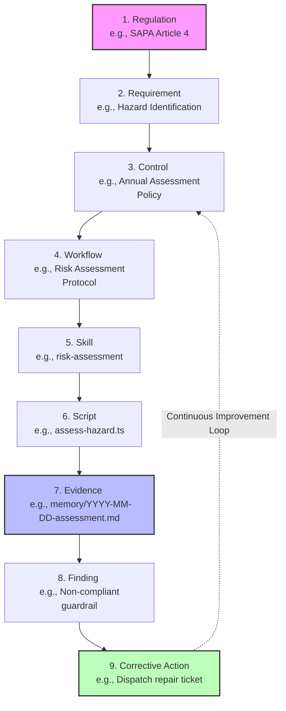

# Safety OS Blueprint: Part II — Enterprise Architecture

> **⚠️ Historical v4.0 design note (updated 2026-06):** The **CodeGraph** MCP and **Neo4j Knowledge Graph** described below were **NOT IMPLEMENTED** and have been removed/archived (see [`_meta/archive/code-graph/README.md`](../archive/code-graph/README.md)). Live regulatory traceability is achieved via `evidence-models/*.json` records + workflow `schema.yaml` `legal_basis` fields + `regulations/KR/legal-glossary.yaml` SSOT — not a graph database. References to CodeGraph/Neo4j/Knowledge Graph in this document are retained as design history only.

## Document Control

| Version | Date       | Author          | Description                                  |
| :---    | :---       | :---            | :---                                         |
| 1.0.0   | 2026-06-05 | Architect Agent | Initial draft for Enterprise Architecture    |

## 2.0 Executive Summary

The Enterprise Architecture for Safety OS defines a robust, scalable, and highly compliant system designed specifically to manage Environmental Health & Safety (EHS) operations. Operating within the stringent regulatory frameworks of South Korea, this architecture directly addresses the operational mandates of the Occupational Safety and Health Act (OSHA-KR) and the severe liability parameters of the Serious Accidents Punishment Act (SAPA). 

This document outlines the structural design, technology choices, and traceability paradigms that form the bedrock of the Safety OS platform. The architecture is inherently modular, leveraging advanced multi-agent orchestration, knowledge graph integrations, and impenetrable audibility layers. These components ensure both the flexibility required in dynamic manufacturing or operational workflows and the rigidity necessary for legal compliance verification. By defining clear boundaries across nine distinct layers, the system prevents unauthorized actions, maintains an unbroken chain of evidence, and enables rapid adaptation to evolving safety regulations.

---

## 2.1 Reference Architecture

The Safety OS Reference Architecture is structurally partitioned into nine distinct layers (Layer 0 through Layer 8), with each layer serving a clearly defined functional domain. This layered, decoupled approach ensures separation of concerns, simplifies maintenance, and allows for independent scaling of different system components. The architecture emphasizes a decentralized, agent-driven execution model where specialized AI agents collaborate across these layers to fulfill complex EHS workflows without compromising security or operational integrity.

### Architecture Overview Diagram

```mermaid
flowchart TD
    subgraph Layer 8: Security, Governance & Compliance
        L8_1[Identity & Access Mgmt]
        L8_2[Immutable Audit Logging]
        L8_3[SAPA/OSHA-KR Policy Enforcement]
        L8_4[Zero-Trust Agent Boundaries]
    end

    subgraph Layer 7: User Interface & Experience
        L7_1[Antigravity CLI / User Terminal]
        L7_2[Markdown Artifact Renderers]
        L7_3[Interactive Dashboards]
    end

    subgraph Layer 6: EHS Domain Applications
        L6_1[Risk Assessment & Matrix Module]
        L6_2[Permit-to-Work (PTW) Gateway]
        L6_3[Incident Response & Escalation]
        L6_4[Compliance Gap Analyzer]
    end

    subgraph Layer 5: Enterprise Services & APIs
        L5_1[MCP Tool Registry]
        L5_2[Workflow Execution Engine]
        L5_3[External Integration Gateway]
    end

    subgraph Layer 4: AI Models & LLM Engine
        L4_1[Claude 3.5 / Gemini 1.5 Subsystems]
        L4_2[3-Tier Model Routing Strategy]
        L4_3[Context Window Manager]
    end

    subgraph Layer 3: Agent Orchestration
        L3_1[PM / Chief Safety Officer Gateway]
        L3_2[Specialist Agent Pool]
        L3_3[Subagent Dispatcher & Concurrency]
    end

    subgraph Layer 2: Core Platform & Integration
        L2_1[File System IO & UTF-8 Enforcement]
        L2_2[GitHub Sync & Pre-commit Hooks]
        L2_3[Local Shell Executor]
    end

    subgraph Layer 1: Evidence & Regulation Store
        L1_1[Local File Storage / Workspace]
        L1_2[evidence-models/ JSON + regulations/KR/]
        L1_3[Memory & Session Logging]
    end

    subgraph Layer 0: Infrastructure & Hosting
        L0_1[Local On-Premises Hardware]
        L0_2[Windows OS Environment]
        L0_3[Air-Gapped Subnets]
    end

    L7_1 --> L8_1
    L7_1 --> L3_1
    L6_1 --> L5_2
    L3_1 --> L3_2
    L3_1 --> L4_2
    L3_2 --> L5_1
    L5_1 --> L2_1
    L5_1 --> L2_2
    L2_1 --> L1_1
    L2_1 --> L1_2
    L1_1 --> L0_1
    
    L8_2 -.-> L1_1
    L8_3 -.-> L3_1
```

### Layer Deep Dive

#### Layer 0: Infrastructure & Hosting
At the absolute foundation, Layer 0 provides the physical or virtualized computing resources required to run Safety OS. In its primary configuration, the system operates on the user's local hardware (specifically optimized for Windows environments typical in enterprise corporate networks). This on-premises focus is highly intentional; it maintains strict data sovereignty and eliminates cloud dependency for sensitive enterprise data, trade secrets, and internal safety vulnerabilities. The infrastructure layer is designed to support air-gapped environments often found in secure manufacturing facilities.

#### Layer 1: Data Storage & Knowledge Graph
This layer handles the persistence of all system artifacts, configurations, state, and historical memory. Instead of relying solely on traditional relational databases, Safety OS embraces a "docs-as-code" paradigm utilizing local file storage for markdown-based configuration, coupled with graph databases for relational mapping.
- **Local Markdown Workspace:** All agent definitions, system prompts, operational workflows, and historical session logs (`memory/` directory) are stored as flat files. This ensures human readability and version control simplicity.
- **CodeGraph Integration:** CodeGraph maintains a continuous semantic understanding of the codebase and document relationships. It allows agents to navigate complex project structures efficiently, understanding how a change in a regulation file impacts a specific risk assessment template.

#### Layer 2: Core Platform & Integration
Layer 2 provides the fundamental building blocks for interacting with the underlying OS and external code repositories. It bridges the AI logic with physical machine state.
- **File System IO:** Strictly enforced UTF-8 read/write utilities that agents use to modify artifacts. This prevents encoding corruptions common in localized Korean environments (CP949).
- **GitHub Sync:** Native Git synchronization mechanisms ensure strict version control. All changes to configurations or safety protocols must pass through automated CI/CD pipelines and QA audit scripts before being merged into the main branch.

#### Layer 3: Agent Orchestration & Coordination
The intelligence hub of the multi-agent system. Layer 3 manages the lifecycle, dispatching, and inter-agent communication, ensuring that no agent exceeds its authority.
- **PM / Chief Safety Officer (CSO) Gateway:** The singular, highly privileged entry point for user requests. The PM triages inputs, verifies the `legal_basis` for any requested action, and acts as the gatekeeper. Users cannot invoke specialized agents directly.
- **Specialist Agent Pool:** Domain-specific entities like the Safety Governance Manager, Compliance Agent, Risk Assessment Agent, and Emergency Agent. Each possesses strict boundaries and localized contexts.
- **Subagent Dispatcher:** Handles the spawning of parallel execution agents (e.g., Automation Engineers) for distributed task processing, utilizing reactive wakeup mechanisms to avoid costly polling loops.

#### Layer 4: AI Models & LLM Engine
Layer 4 abstracts the underlying Large Language Models, optimizing for cost, speed, and reasoning capability through a strict 3-Tier Model Routing Strategy:
- **High-Tier (Reasoning):** Deployed for the PM and Architect agents. Utilizes the most capable models for complex reasoning, architectural planning, and interpreting ambiguous legal statutes.
- **Medium-Tier (Review):** Deployed for Quality Assurance, code review, and audit validation. Provides a balance of speed and reliability to ensure executing agents followed instructions.
- **Low-Tier (Execution):** Deployed for rapid code generation, text replacement, and simple execution tasks where the parameters are strictly defined.

#### Layer 5: Enterprise Services & APIs
This layer exposes reusable tools and skills to the agents via the Model Context Protocol (MCP).
- **MCP Tool Registry:** A standardized registry of capabilities (e.g., `write_to_file`, `search_web`, `run_command`). MCP enables seamless, secure integration of file system tools without giving the LLM raw shell access by default.
- **Workflow Execution Engine:** Parses structured EHS operational sequences (e.g., standard operating procedures) and translates them into actionable tool calls for the agents.

#### Layer 6: EHS Domain Applications
Layer 6 contains the localized business logic specific to South Korean EHS compliance and facility operations.
- **Risk Assessment Module:** Automates hazard identification and scoring based on user input or sensor data, generating compliant risk registers.
- **Permit-to-Work (PTW):** Orchestrates the issuance, validation, and archiving of high-risk work permits.
- **Incident Response Tracker:** Escalates emergencies to human operators and logs immediate remediation steps to demonstrate legal due diligence.

#### Layer 7: User Interface & Experience
The interaction point for human operators and facility managers. 
- **Antigravity CLI / User Terminal:** The primary execution environment providing a chat-like command structure.
- **Markdown Artifacts:** Dashboards, implementation plans, and reports generated by the system are rendered as interactive Markdown artifacts, supporting alerts, Mermaid diagrams, and code diffs for immediate user review.

#### Layer 8: Security, Governance & Compliance
An overarching, cross-cutting layer that intersects all others. It acts as the ultimate authority for system actions.
- **Legal Basis Gate:** Enforces the requirement that every workflow execution must reference a specific legal article. If a workflow lacks a `legal_basis` field, execution is halted.
- **Immutable Audit Logging:** Ensures that every decision made by an agent, every file edited, and every evidence artifact generated is timestamped and cryptographically signed within the Git history, providing an unassailable audit trail for regulatory inspectors.

---

## 2.2 Technology Stack

The technology stack underpinning Safety OS is carefully selected to support a highly autonomous, transparent, and verifiable AI-driven platform. The stack is categorized into Primary (currently active core components), Extended (domain-specific integrations for the Korean market), and Future (planned expansions for enterprise scalability).

### Primary Stack
These are the core technologies driving the day-to-day operations, orchestration, and state management of Safety OS:
- **CodeGraph:** Moving beyond simple lexical `grep` searches, CodeGraph provides advanced semantic code intelligence. It maps relationships between files, agents, workflows, and legal requirements, allowing agents to navigate the workspace contextually and understand the blast radius of any operational change.
- **Antigravity CLI / Claude Code:** The primary execution environments and orchestrators. They provide the shell context for running the agentic loops, handling user input, and rendering UI artifacts directly in the developer or manager's terminal.
- **GitHub / Git:** The single source of truth for version control and state mutation. All configuration changes, workflow updates, and agent memory logs are synchronized via Git. Strict pre-commit hooks ensure that direct code modification bypassing the PM's QA gates are blocked.
- **Model Context Protocol (MCP):** The standardized, secure communication protocol used to expose tools (skills) to the LLMs. MCP acts as a secure bridge, allowing the AI to safely interact with local file systems, database queries, and external APIs without exposing underlying system vulnerabilities.
- **Markdown (MD) & Mermaid JS:** The absolute standard formats for all documentation, planning, and architectural diagrams. They ensure that knowledge remains fully human-readable for audits while being easily parseable by LLMs.

### Extended Stack (Domain Specific)
Technologies tailored specifically for the South Korean EHS context and specialized industry workflows:
- **mcp-kr-legislation:** A custom, proprietary MCP server providing agents with direct querying capabilities against the South Korean legislative database. It allows agents to pull exact, up-to-date article texts from OSHA-KR and SAPA, guaranteeing that the mandatory `legal_basis` requirement is grounded in current law.
- **K-Skill Architecture:** A specialized suite of MCP tools and predefined markdown workflows adapted for local business practices. This includes standardized risk assessment matrices formatted for the Ministry of Employment and Labor (MOEL) and automated translation layers handling the crossover between English documentation requirements and Korean operational interfaces.

### Future Stack
Technologies slated for future integration to enhance system intelligence and enterprise reach:
- **Neo4j Graph Database:** Intended to eventually supplement CodeGraph for more complex, enterprise-wide knowledge representation. Neo4j will allow for deep, multi-hop queries across the entire Knowledge Traceability Model, identifying systemic risks across disparate manufacturing plants and correlating incidents to specific policy failures.
- **OpenAI Agent SDK:** To provide optionality and prevent vendor lock-in, the architecture is designed to eventually support OpenAI's agent frameworks alongside the current Anthropic/Google-centric models, enabling a true hybrid multi-model orchestration strategy based on cost-efficiency.

---

## 2.3 Knowledge Traceability Model

A cornerstone of the Safety OS architecture is its unbreakable chain of evidence and justification. In the context of EHS compliance—particularly under the severe personal liability parameters outlined in the Serious Accidents Punishment Act (SAPA)—it is never enough for an automated system to simply execute a task. The system must definitively prove *why* the task was executed, *how* it addresses a specific legal requirement, and *who* authorized it.

The Knowledge Traceability Model establishes a strict, directional hierarchy connecting high-level government regulations to granular, machine-executable artifacts. Every action taken by a Safety OS agent must be traceable back up this chain. If a link in the chain is broken or missing, the action is flagged as non-compliant and halted by the PM Gateway.

### Traceability Hierarchy

1. **Regulation:** The foundational law establishing legal liability (e.g., SAPA Article 4, OSHA-KR Article 36).
2. **Requirement:** A specific, actionable mandate derived from the regulation (e.g., "The business owner must establish a comprehensive risk assessment procedure").
3. **Control:** The internal organizational policy or management system designed to meet the requirement (e.g., "Annual Plant-Wide Risk Assessment Policy v2.1").
4. **Workflow:** The step-by-step procedural document defined in Safety OS to implement the control (e.g., `workflows/annual-risk-assessment.md`).
5. **Skill:** The specific agent capability or MCP tool required to execute a step in the workflow (e.g., `risk-assessment-agent` utilizing the `risk-matrix-calculator` skill).
6. **Script:** The underlying deterministic code executing the skill securely (e.g., `scripts/assess-hazard.ts`).
7. **Evidence:** The immutable artifact generated upon execution, permanently logged in the system (e.g., `memory/2026-06-05-assessment-zone-A.md`).
8. **Finding:** An observation derived from the evidence (e.g., "High-risk identified: Non-compliant guardrail near Stamping Press 4").
9. **Corrective Action:** The steps taken to resolve the finding, which feeds back into the system to improve the foundational Control, demonstrating continuous improvement.

### Traceability Chain Diagram



### Operationalizing Traceability for Legal Defense

The traceability model is not merely a theoretical diagram; it is mechanically enforced via the `legal_basis` gateway. 

When the PM / CSO agent receives a request from a floor manager to initiate a workflow (for instance, executing a Permit-to-Work for confined space entry), the PM first parses the defined markdown workflow. The workflow definition file MUST contain frontmatter metadata explicitly linking it to a Requirement and a Regulation. 

```yaml
# Example Workflow Header
name: Confined Space Permit-to-Work
legal_basis: OSHA-KR Article 114
control_ref: CTRL-089-Confined-Space
```

If the `legal_basis` tag is missing, the PM agent actively rejects the request, generating an Escalation alert indicating that the workflow cannot be legally justified.

When the executing specialist agent (e.g., the Safety Workflow Manager) successfully completes the task, it generates an Evidence record in the `memory/` directory. This Evidence record automatically inherits the metadata of its parent Workflow, appending execution timestamps, agent IDs, and cryptographic hashes of the file state.

During a regulatory audit (whether simulated internally or conducted by the Ministry of Employment and Labor), the Audit Agent leverages this model to generate comprehensive compliance reports instantaneously. 

- **Top-Down Querying:** An auditor can start at SAPA Article 4 and query downwards: *"Show me all Controls, Workflows, and generated Evidence tied to this article in the past quarter."* The CodeGraph retrieves exactly the chain of documents linking the law to the factory floor operations.
- **Bottom-Up Querying:** Conversely, an auditor can start at a specific Corrective Action or incident report and trace upwards to verify that the action directly addressed a legal Requirement and followed approved policy. 

This bidirectional traceability is the ultimate safeguard. It transforms subjective safety management into objective, provable data, establishing an ironclad defense of "due diligence" under South Korean legal frameworks.
